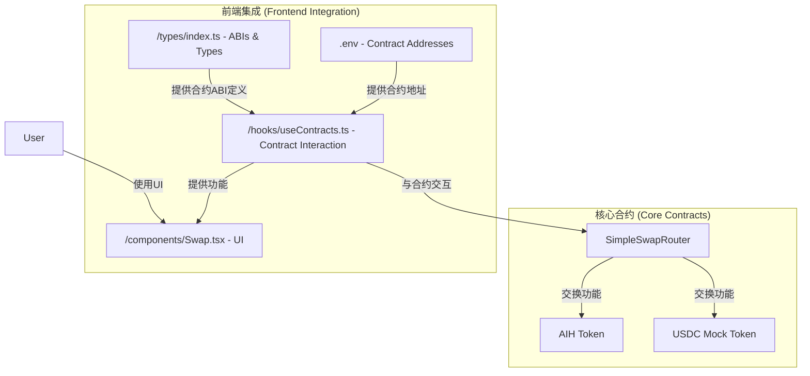
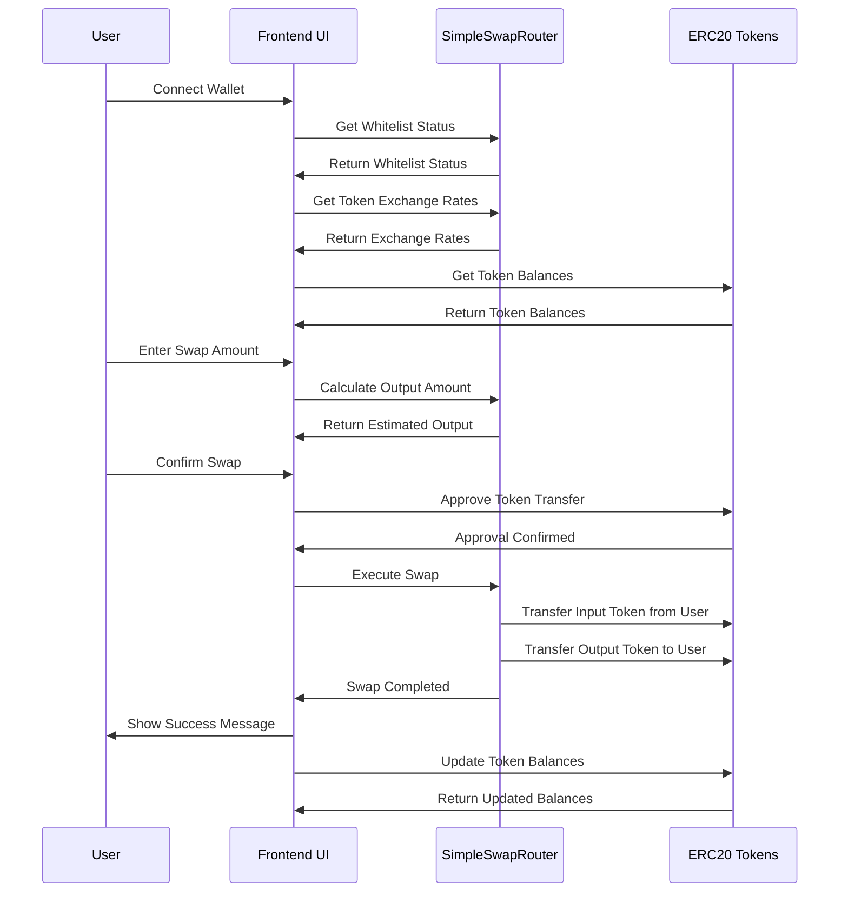

 # AI Harvest Frontend Integration

## 项目更新摘要 (Project Update Summary)

我们已经成功将前端与新的SimpleSwapRouter合约集成，替换了之前的可升级代理模式。以下是已完成的工作和下一步计划。

We have successfully integrated the frontend with the new SimpleSwapRouter contract, replacing the previous upgradeable proxy pattern. Below is a summary of completed work and next steps.

## 已完成的改动 (Completed Changes)

### 1. 类型定义更新 (Type Definitions Update)
- 在`types/index.ts`中添加了`SIMPLE_SWAP_ROUTER_ABI`，包含所有合约功能和事件
- Added `SIMPLE_SWAP_ROUTER_ABI` to `types/index.ts` with all contract functions and events

### 2. 环境变量配置 (Environment Variables Configuration)
- 更新了`.env`文件，添加了SimpleSwapRouter合约地址和代币地址
- Updated `.env` file with SimpleSwapRouter contract address and token addresses
```
REACT_APP_SIMPLE_SWAP_ROUTER_ADDRESS=0x5Dcde9e56b34e719a72CF060802D276dcb580730
REACT_APP_AIH_TOKEN_ADDRESS=0xFcB512f45172aa1e331D926321eaA1C52D7dce8E
REACT_APP_USDC_TOKEN_ADDRESS=0xB35B48631b69478f28E4365CC1794E378Ad0FA02
```

### 3. 合约钩子增强 (Contract Hook Enhancement)
- 增强了`useContracts.ts`钩子，添加了与SimpleSwapRouter交互的功能：
- Enhanced the `useContracts.ts` hook with functionality for SimpleSwapRouter interaction:
  - `getSimpleSwapInfo()`: 获取费率和国库地址信息 (Get fee rates and treasury address)
  - `getSimpleSwapOutputAmount()`: 计算兑换输出金额 (Calculate swap output amount)
  - `simpleSwap()`: 执行代币兑换 (Execute token swap)
  - `addSimpleLiquidity()`: 添加流动性 (Add liquidity)

### 4. 交换界面更新 (Swap Interface Update)
- 修改了`Swap.tsx`组件，使用SimpleSwapRouter功能：
- Modified the `Swap.tsx` component to use SimpleSwapRouter functionality:
  - 使用部署的AIH和USDC代币地址 (Used deployed AIH and USDC token addresses)
  - 添加了白名单功能支持 (Added whitelist functionality support)
  - 改进了费用和汇率显示 (Improved fee and exchange rate display)
  - 添加了代币余额自动更新 (Added automatic token balance updates)

## 下一步工作 (Next Steps)

### 1. 流动性管理界面 (Liquidity Management Interface)
- 创建添加和移除流动性的界面 (Create interface for adding and removing liquidity)
- 显示用户的流动性提供份额 (Display user's liquidity provision shares)
- 添加流动性奖励显示 (Add liquidity rewards display)

### 2. 管理员面板 (Admin Panel)
- 为合约拥有者开发管理面板 (Develop admin panel for contract owner)
- 实现代币白名单管理 (Implement token whitelist management)
- 添加费率配置和最大兑换限额设置 (Add fee configuration and max swap amount settings)
- 提供暂停/恢复功能 (Provide pause/unpause functionality)

### 3. 交易历史 (Transaction History)
- 添加用户交易历史日志 (Add user transaction history log)
- 显示过去的兑换、添加流动性和移除流动性操作 (Display past swaps, liquidity additions and removals)
- 集成区块浏览器链接 (Integrate block explorer links)

### 4. UI/UX改进 (UI/UX Improvements)
- 改进响应式设计，支持移动设备 (Improve responsive design for mobile devices)
- 添加深色模式 (Add dark mode)
- 优化加载状态和错误处理 (Optimize loading states and error handling)
- 添加汇率图表 (Add exchange rate charts)

### 5. 测试与文档 (Testing and Documentation)
- 编写单元测试和集成测试 (Write unit tests and integration tests)
- 完善用户文档和开发文档 (Complete user documentation and developer documentation)
- 添加交互式教程 (Add interactive tutorials)

## 技术债务 (Technical Debt)
- 移除未使用的旧版可升级合约代码 (Remove unused legacy upgradeable contract code)
- 重构重复逻辑 (Refactor duplicate logic)
- 优化代码以减少gas消耗 (Optimize code to reduce gas consumption)

## 架构图 (Architecture Diagram)



## 交互流程 (Interaction Flow)

