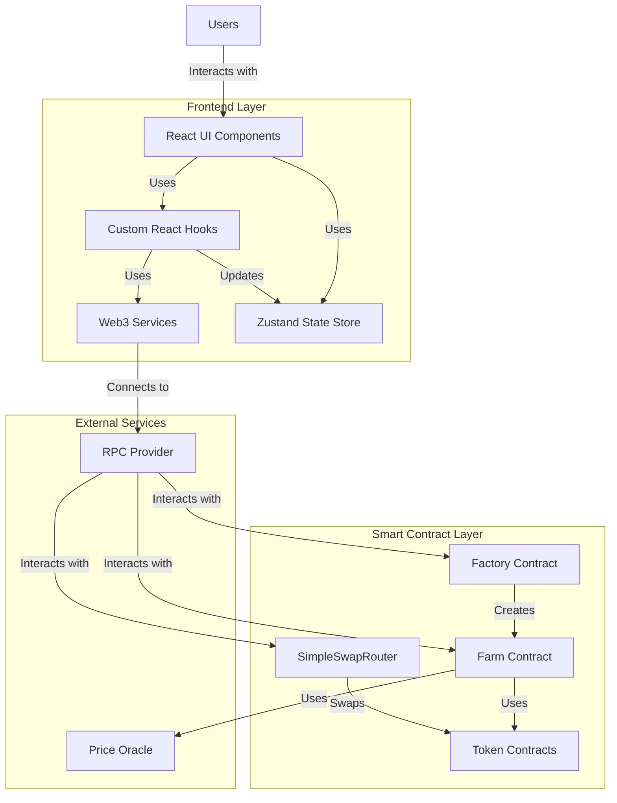

# AI Harvest Project Architecture
# AI Harvest 项目架构

## Architecture Overview
## 架构概述

AI Harvest is a decentralized yield farming platform that uses AI strategies to optimize returns. The project consists of two main components:
AI Harvest 是一个去中心化的收益耕作平台，使用人工智能策略来优化回报。该项目由两个主要部分组成：

1. **Smart Contracts**: Solidity contracts deployed on Ethereum that handle all on-chain operations
   **智能合约**：部署在以太坊上的Solidity合约，处理所有链上操作
   
2. **Frontend**: React application that provides a user interface for interacting with the smart contracts
   **前端**：提供与智能合约交互的用户界面的React应用程序

Below is a diagram representing the high-level architecture:
以下是表示高层架构的图表：



## Component Details
## 组件详细信息

### Frontend Layer
### 前端层

#### UI Components
#### UI组件
- **Pages**: Home, Farms, Staking, Swap, AIAssistant
  **页面**：首页、农场、质押、交换、AI助手
- **Components**: Header, Footer, Farm cards, Modals, Notifications
  **组件**：页眉、页脚、农场卡片、模态框、通知

#### Custom Hooks
#### 自定义钩子
- **useWeb3**: Manages wallet connection and basic web3 functionality
  **useWeb3**：管理钱包连接和基本的web3功能
- **useAccount**: Handles wallet account connection, status and address management
  **useAccount**：处理钱包账户连接、状态和地址管理
- **useContracts**: Handles contract interactions and state management
  **useContracts**：处理合约交互和状态管理

#### State Management
#### 状态管理
- **Zustand Store**: Lightweight state management for global application state
  **Zustand存储**：用于全局应用状态的轻量级状态管理

#### Web3 Services
#### Web3服务
- Contract ABIs
  合约ABI
- Transaction handling
  交易处理
- Error handling
  错误处理

### Smart Contract Layer
### 智能合约层

#### Factory Contract (FactoryUpgradeableV2)
#### 工厂合约 (FactoryUpgradeableV2)
- Deploys and manages Farm contracts
  部署和管理农场合约
- Maintains registry of all deployed farms
  维护所有已部署农场的注册表
- Upgradeable design for future improvements
  可升级设计以便未来改进

#### Farm Contract (FarmUpgradeableV2)
#### 农场合约 (FarmUpgradeableV2)
- Handles deposits and withdrawals
  处理存款和取款
- Manages yield farming strategy
  管理收益耕作策略
- Calculates and distributes rewards
  计算和分配奖励
- Upgradeable architecture
  可升级架构

#### SimpleSwapRouter
#### 简单交换路由器
- Facilitates token swaps
  促进代币交换
- Provides liquidity routing
  提供流动性路由
- Optimizes for best execution price
  优化最佳执行价格

#### Token Contracts
#### 代币合约
- ERC20 tokens used in the platform
  平台使用的ERC20代币
- Upgradeable token implementation (TestTokenUpgradeableV2)
  可升级代币实现 (TestTokenUpgradeableV2)

### Data Flow
### 数据流

1. Users interact with the React UI
   用户与React UI交互
2. UI components use custom hooks to trigger actions
   UI组件使用自定义钩子触发操作
3. Hooks use Web3 services to create transactions and update the Zustand store
   钩子使用Web3服务创建交易并更新Zustand存储
4. Transactions are sent to the blockchain via RPC providers
   通过RPC提供商将交易发送到区块链
5. Smart contracts execute the transactions and update state
   智能合约执行交易并更新状态
6. Updated state is read from blockchain and displayed in UI
   从区块链读取更新的状态并在UI中显示

## Directory Structure
## 目录结构

```
AIHarvest/
├── aiharvest/                      # Smart contract project
│   ├── contracts/                  # Solidity contracts
│   │   ├── FarmUpgradeableV2.sol   # Main farming contract (upgradeable)
│   │   ├── FactoryUpgradeableV2.sol # Factory for creating farms (upgradeable)
│   │   ├── SimpleSwapRouter.sol    # Token swap router
│   │   ├── TestTokenUpgradeableV2.sol # Test token for development (upgradeable)
│   │   └── interfaces/             # Contract interfaces
│   │       └── IFarmUpgradeable.sol # Interface for Farm contract
│   ├── scripts/                    # Deployment and interaction scripts
│   └── test/                       # Contract tests
│
├── frontend-react/                 # React frontend application
│   ├── public/                     # Static assets
│   └── src/                        # Source code
│       ├── components/             # Reusable UI components
│       │   └── Layout/             # Layout components (Header, Footer)
│       ├── hooks/                  # Custom React hooks
│       │   ├── useWeb3.ts          # Web3 connection hook
│       │   ├── useAccount.ts       # Wallet account management
│       │   └── useContracts.ts     # Contract interaction hook
│       ├── store/                  # State management
│       │   └── index.ts            # Zustand store
│       ├── styles/                 # CSS styles
│       ├── assets/                 # Images and other static assets
│       ├── types/                  # TypeScript type definitions
│       ├── pages/                  # Page components
│       │   ├── Home.tsx            # Home page
│       │   ├── Farms.tsx           # Farms listing page
│       │   ├── Staking.tsx         # Staking page
│       │   ├── Swap.tsx            # Token swap page
│       │   ├── AIAssistant.tsx     # AI assistant page
│       │   └── NotFound.tsx        # 404 page
│       └── routes.tsx              # Application routing
│
├── .github/                        # GitHub workflows for CI/CD
├── API-DOCS.md                     # API documentation
├── DEPLOYMENT.md                   # Deployment instructions
├── SEPOLIA_DEPLOYMENT.md           # Testnet deployment guide
├── SETUP.md                        # Setup instructions
└── PROJECT_ARCHITECTURE.md         # This architecture document (bilingual)
```

## Technology Stack
## 技术栈

### Frontend
### 前端
- **React 19**: Modern UI library for building interactive interfaces
  **React 19**：构建交互式界面的现代UI库
- **TypeScript**: Static typing for improved code quality
  **TypeScript**：静态类型检查以提高代码质量
- **Zustand**: Lightweight state management
  **Zustand**：轻量级状态管理
- **Ethers.js**: Ethereum JavaScript library
  **Ethers.js**：以太坊JavaScript库
- **React Router v7**: For navigation and routing
  **React Router v7**：用于导航和路由
- **Material UI & HeadlessUI**: UI component libraries
  **Material UI & HeadlessUI**：UI组件库

### Backend/Blockchain
### 后端/区块链
- **Solidity 0.8.19**: Smart contract language
  **Solidity 0.8.19**：智能合约语言
- **Hardhat**: Development environment for Ethereum
  **Hardhat**：以太坊开发环境
- **OpenZeppelin**: Secure contract libraries and upgrade patterns
  **OpenZeppelin**：安全的合约库和升级模式
- **Ethereum**: Main blockchain platform (with Sepolia testnet support)
  **以太坊**：主要区块链平台（支持Sepolia测试网）

## Development and Deployment Workflow
## 开发和部署工作流

1. Smart contract development and testing in Hardhat environment
   在Hardhat环境中进行智能合约开发和测试
2. Frontend development using React and TypeScript
   使用React和TypeScript进行前端开发
3. Local testing with Hardhat node
   使用Hardhat节点进行本地测试
4. Testnet deployment to Sepolia
   部署到Sepolia测试网
5. Frontend deployment to web hosting
   将前端部署到网络托管
6. Mainnet deployment (when ready)
   主网部署（准备就绪时）

This architecture provides a solid foundation for a modern DeFi application with AI-enhanced features.
这种架构为具有AI增强功能的现代DeFi应用程序提供了坚实的基础。 