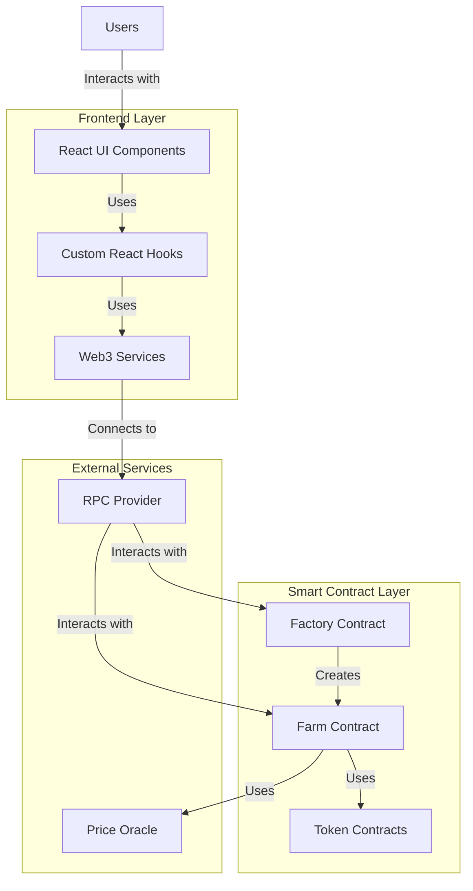

# AI Harvest Project Architecture

## Architecture Overview

AI Harvest is a decentralized yield farming platform that uses AI strategies to optimize returns. The project consists of two main components:

1. **Smart Contracts**: Solidity contracts deployed on Ethereum that handle all on-chain operations
2. **Frontend**: React application that provides a user interface for interacting with the smart contracts

Below is a diagram representing the high-level architecture:



## Component Details

### Frontend Layer

#### UI Components
- **Pages**: Home, Farms, Staking, Swap, AIAssistant
- **Components**: Header, Footer, Farm cards, Modals, Notifications

#### Custom Hooks
- **useWeb3**: Manages wallet connection and basic web3 functionality
- **useContracts**: Handles contract interactions and state management

#### Web3 Services
- Contract ABIs
- Transaction handling
- Error handling

### Smart Contract Layer

#### Factory Contract
- Deploys and manages Farm contracts
- Maintains registry of all deployed farms

#### Farm Contract
- Handles deposits and withdrawals
- Manages yield farming strategy
- Calculates and distributes rewards

#### Token Contracts
- ERC20 tokens used in the platform
- Testing tokens for development

### Data Flow

1. Users interact with the React UI
2. UI components use custom hooks to trigger actions
3. Hooks use Web3 services to create transactions
4. Transactions are sent to the blockchain via RPC providers
5. Smart contracts execute the transactions and update state
6. Updated state is read from blockchain and displayed in UI

## Directory Structure

```
AIHarvest/
├── aiharvest/                  # Smart contract project
│   ├── contracts/              # Solidity contracts
│   │   ├── Farm.sol            # Main farming contract
│   │   ├── Factory.sol         # Factory for creating farms
│   │   └── TestToken.sol       # Test token for development
│   ├── scripts/                # Deployment and interaction scripts
│   └── test/                   # Contract tests
│
├── frontend-react/             # React frontend application
│   ├── public/                 # Static assets
│   └── src/                    # Source code
│       ├── components/         # Reusable UI components
│       ├── hooks/              # Custom React hooks
│       │   ├── useWeb3.ts      # Web3 connection hook
│       │   └── useContracts.ts # Contract interaction hook
│       ├── pages/              # Page components
│       │   ├── Home.tsx        # Home page
│       │   ├── Farms.tsx       # Farms listing page
│       │   └── ...             # Other pages
│       └── types/              # TypeScript type definitions
│
├── .github/                    # GitHub workflows for CI/CD
├── API-DOCS.md                 # API documentation
├── README.md                   # Project overview
├── SETUP.md                    # Setup instructions
└── PROJECT_ARCHITECTURE.md     # This architecture document
``` 