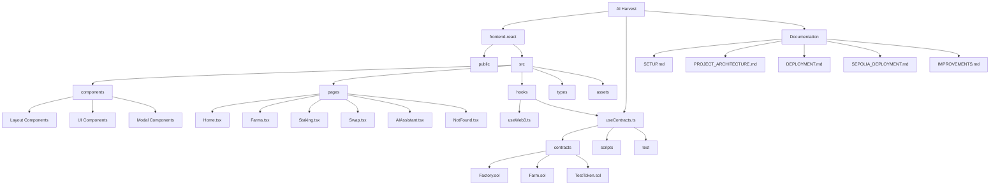
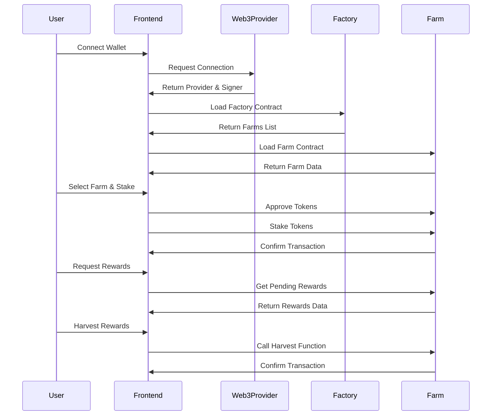

# AI Harvest Project Structure

## Architecture Flow Diagram

```mermaid
graph TD
    subgraph "Frontend"
        UI[React UI] --> |Uses| Hooks[Hooks]
        UI --> |Renders| Pages[Page Components]
        Pages --> |Uses| Components[UI Components]
        Hooks --> |Calls| Contracts[Contract Interfaces]
        Contracts --> |Connects to| Provider[Web3 Provider]
    end

    subgraph "Smart Contracts"
        Provider --> |Interacts with| Factory[Factory Contract]
        Factory --> |Creates| Farm[Farm Contract]
        Farm --> |Uses| Token[Token Contract]
    end

    subgraph "Assets"
        UI --> |Loads| Assets[Static Assets]
    end
```

## Directory Structure



## Contract Interaction Flow



You can view these diagrams by copying the code and pasting it into https://mermaid.live 