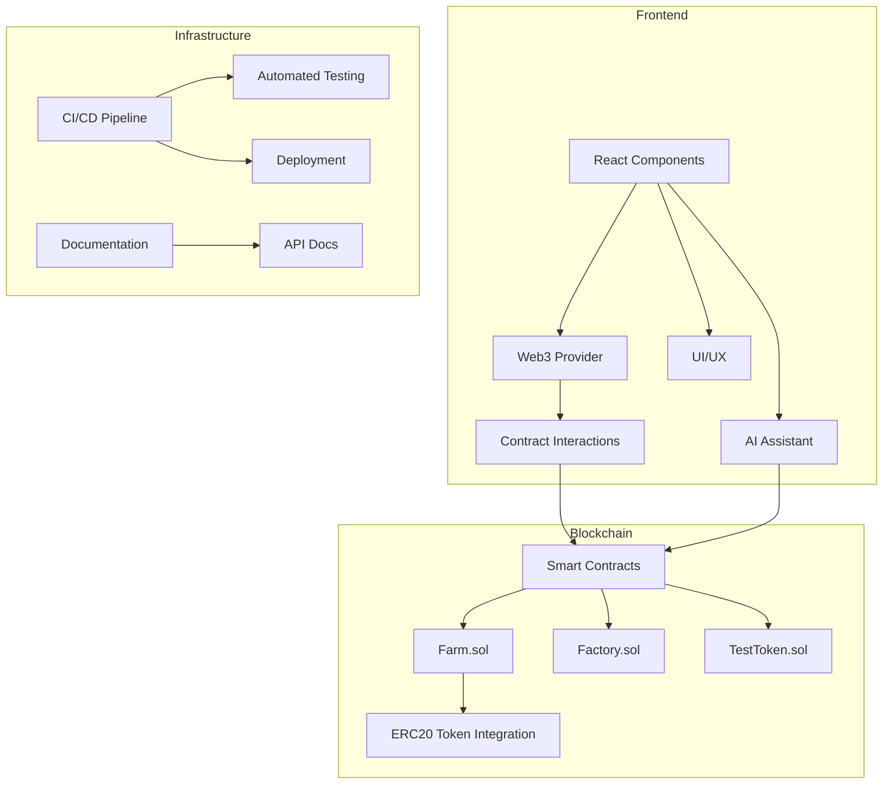

# AI Harvest - DeFi Yield Farming Platform

AI Harvest is a decentralized yield farming platform that leverages AI to optimize farming strategies. This project demonstrates full-stack blockchain development skills, including smart contract development, frontend implementation, and integration with DeFi protocols.

## Project Overview

AI Harvest allows users to:
- Stake LP tokens in various farming pools
- Earn rewards based on staking duration and pool allocation
- Compound rewards automatically
- Swap tokens using Uniswap integration
- Get AI-powered recommendations for optimal farming strategies

## Architecture



## Tech Stack

- **Smart Contracts**: Solidity, OpenZeppelin
- **Frontend**: React, TypeScript, ethers.js
- **Testing**: Hardhat, Mocha, Chai
- **CI/CD**: GitHub Actions
- **Design**: CSS3, Responsive Design

## Setup and Installation

### Prerequisites

- Node.js v14+
- npm or yarn
- MetaMask browser extension

### Smart Contracts

```bash
# Navigate to the contracts directory
cd aiharvest

# Install dependencies
npm install

# Compile contracts
npx hardhat compile

# Run tests
npx hardhat test

# Deploy to a local network
npx hardhat node
npx hardhat run scripts/deploy.js --network localhost
```

### Frontend

```bash
# Navigate to the frontend directory
cd frontend-react

# Install dependencies
npm install

# Start development server
npm start

# Build for production
npm run build
```

## Smart Contract Architecture

The project consists of three main contracts:

1. **Farm.sol** - The main farming contract that handles staking, rewards, and withdrawals
2. **Factory.sol** - Creates and manages Farm contracts
3. **TestToken.sol** - A simple ERC20 token for testing purposes

## Frontend Structure

The frontend is built with React and organized into the following structure:

```
frontend-react/
├── public/
├── src/
│   ├── components/
│   │   ├── Layout/
│   │   ├── Farms/
│   │   ├── Staking/
│   │   ├── Swap/
│   │   └── AIAssistant/
│   ├── hooks/
│   │   ├── useWeb3.ts
│   │   ├── useContracts.ts
│   │   └── useWallet.ts
│   ├── services/
│   │   ├── uniswap.service.ts
│   │   ├── farm.service.ts
│   │   └── ai.service.ts
│   ├── utils/
│   ├── App.tsx
│   └── index.tsx
└── package.json
```

## Testing

The project includes comprehensive testing:

- **Smart Contract Tests**: Unit tests for all contract functions
- **Integration Tests**: End-to-end testing of contract interactions
- **Frontend Tests**: Component tests using React Testing Library

## Deployment

Deployment instructions for various networks:

- **Local Development**: Hardhat local network
- **Test Networks**: Goerli, Sepolia
- **Mainnet**: Ethereum, Arbitrum, Optimism

## API Documentation

The frontend interacts with the blockchain through these primary methods:

### Farm Contract API

```typescript
interface FarmAPI {
  getPoolInfo(pid: number): Promise<PoolInfo>;
  deposit(pid: number, amount: string): Promise<Transaction>;
  withdraw(pid: number, amount: string): Promise<Transaction>;
  pendingReward(pid: number, userAddress: string): Promise<string>;
  compound(pid: number): Promise<Transaction>;
}
```

### Factory Contract API

```typescript
interface FactoryAPI {
  createFarm(
    rewardToken: string,
    rewardPerSecond: string,
    startTime: number
  ): Promise<Transaction>;
  getAllFarms(): Promise<string[]>;
}
```

## License

MIT

## Contributing

Contributions are welcome! Please feel free to submit a Pull Request. 