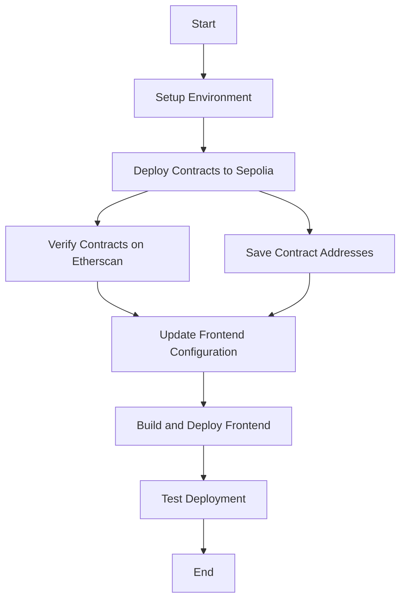

# Sepolia Deployment Guide

This document provides instructions for deploying the AI Harvest project to the Sepolia testnet.

## Current Deployment

The contracts are currently deployed on the Sepolia testnet with the following addresses:

- **TestToken**: `0x58F28DE1257EE7469cffd766BEBFED9769ccEE21`
- **Factory**: `0xE86cD948176C121C8AD25482F6Af3B1BC3F527Df`
- **Farm**: `0x0014685B54C43C2BfA5AB2D4C10a37bb5e746Ed5`

## Redeploying Contracts

If you need to redeploy the contracts, follow these steps:

### Prerequisites

1. Make sure you have Node.js and npm installed
2. Install dependencies in the `aiharvest` directory:
   ```bash
   cd aiharvest
   npm install
   ```
3. Create a `.env` file with the following variables:
   ```
   PRIVATE_KEY=your_private_key_without_0x_prefix
   ALCHEMY_API_KEY=your_alchemy_api_key
   ETHERSCAN_API_KEY=your_etherscan_api_key
   ```
4. Ensure you have some Sepolia ETH in your wallet. You can get some from:
   - [Sepolia Faucet](https://sepoliafaucet.com/)
   - [Alchemy Sepolia Faucet](https://sepoliafaucet.com/)

### Deployment Steps

1. Deploy the contracts to Sepolia:
   ```bash
   npx hardhat run scripts/deploy.js --network sepolia
   ```

2. This will output the contract addresses. Save these addresses as you'll need them for the frontend configuration.

3. Verify the contracts on Etherscan (optional but recommended):
   ```bash
   npx hardhat verify --network sepolia <TestToken_Address>
   npx hardhat verify --network sepolia <Factory_Address>
   npx hardhat verify --network sepolia <Farm_Address>
   ```

### Updating Frontend Configuration

1. Update the `.env` file in the `frontend-react` directory:
   ```
   REACT_APP_FACTORY_ADDRESS=<New_Factory_Address>
   REACT_APP_NETWORK_ID=11155111
   REACT_APP_RPC_URL=https://eth-sepolia.g.alchemy.com/v2/your_alchemy_key
   ```

2. Build and deploy the frontend:
   ```bash
   cd frontend-react
   npm run build
   ```

## Interacting with Deployed Contracts

You can interact with the deployed contracts using various methods:

### Using Hardhat Console

```bash
npx hardhat console --network sepolia
```

```javascript
const Factory = await ethers.getContractFactory("Factory");
const factory = await Factory.attach("0xE86cD948176C121C8AD25482F6Af3B1BC3F527Df");
// Now you can call contract methods
const farmCount = await factory.getFarmCount();
console.log("Farm count:", farmCount.toString());
```

### Using Etherscan

You can also interact with the contracts via Etherscan's "Write Contract" and "Read Contract" interfaces:
- [TestToken on Etherscan](https://sepolia.etherscan.io/address/0x58F28DE1257EE7469cffd766BEBFED9769ccEE21)
- [Factory on Etherscan](https://sepolia.etherscan.io/address/0xE86cD948176C121C8AD25482F6Af3B1BC3F527Df)
- [Farm on Etherscan](https://sepolia.etherscan.io/address/0x0014685B54C43C2BfA5AB2D4C10a37bb5e746Ed5)

## Testing the Deployment

1. Get some test tokens:
   - The TestToken contract has a `faucet()` function that gives 1000 tokens
   - Call this function through Etherscan or using the frontend

2. Create a farming pool:
   - Use the Factory contract's `createFarm()` function
   - Specify the staking token address (TestToken), reward token address (TestToken), and reward rate

3. Stake tokens:
   - Approve the Farm contract to spend your tokens
   - Call the `stake()` function with the amount you want to stake

4. Check rewards:
   - Call the `earned()` function to see your accumulated rewards
   - Use `harvest()` to claim your rewards

## Troubleshooting

- If transactions fail, check that you have enough Sepolia ETH for gas
- Ensure the contract addresses in your frontend configuration are correct
- Check that you're connected to the Sepolia network in MetaMask
- Clear browser cache if you experience persistent issues

## Creating a Demo Environment

For presentations or testing, you might want to set up a complete demo environment:

1. Create multiple test accounts with different token balances
2. Set up several farming pools with different parameters
3. Pre-populate the pools with liquidity
4. Create a script to demonstrate compounding rewards

## Flowchart of Deployment Process

