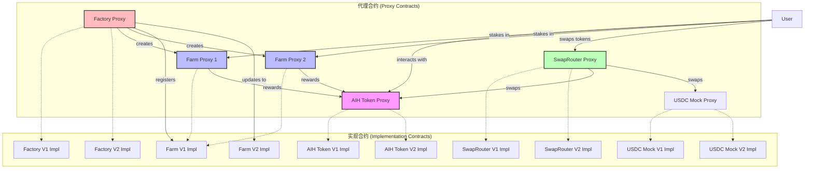
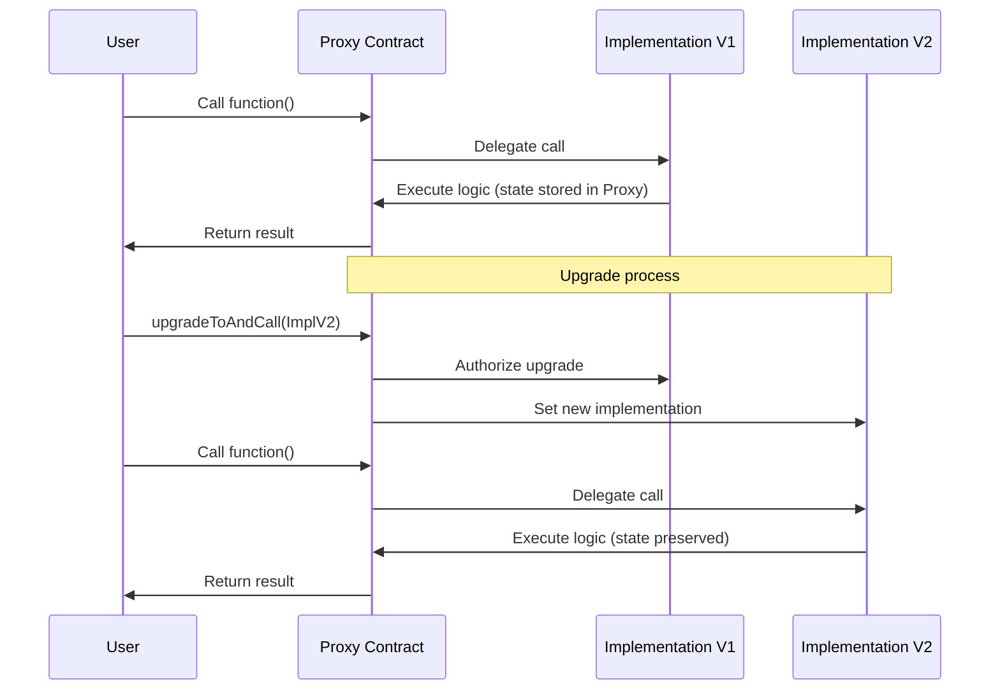
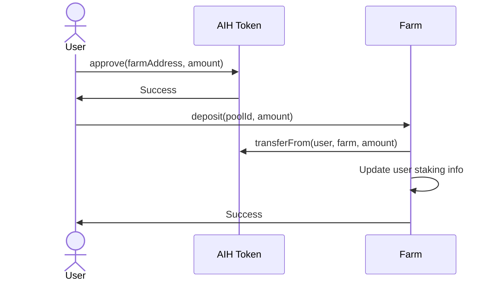
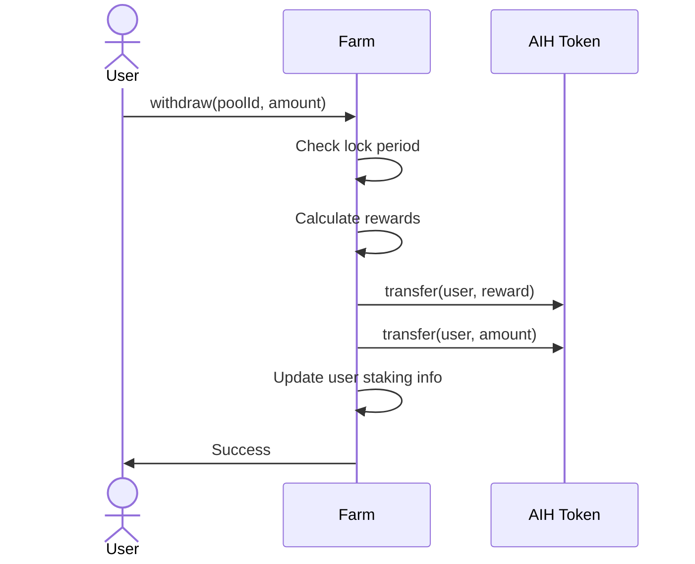
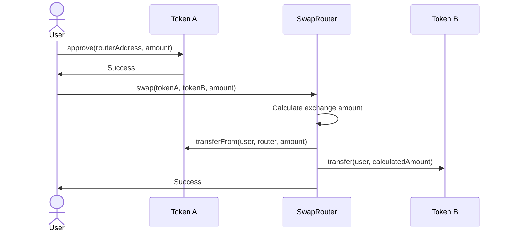

# AI Harvest Contract Architecture

AI Harvest是一个去中心化收益耕作平台，集成了多种DeFi功能和可升级智能合约架构。

This document provides a detailed overview of the AI Harvest contract architecture, including contract relationships, upgrade patterns, and key components.

## 架构概览 (Architecture Overview)

AI Harvest platform uses the OpenZeppelin UUPS proxy pattern for contract upgradeability, allowing the platform to evolve while preserving state and addresses.



## 合约组件 (Contract Components)

### 1. 代币合约 (Token Contracts)

#### TestTokenUpgradeable (V1)
- ERC20兼容代币实现
- 支持铸造新代币
- 可升级设计

#### TestTokenUpgradeableV2 (V2)
- 增加了暂停功能
- 添加了最大供应量限制
- 增加了黑名单功能

### 2. 收益农场 (Yield Farming)

#### FarmUpgradeable (V1)
- 管理用户质押和奖励分配
- 支持锁定期设置
- 计算并分发用户奖励

#### FarmUpgradeableV2 (V2)
- 添加提前解锁功能（需付费）
- 实现奖励加速机制
- 支持池子分类管理

### 3. 代币交换 (Token Swapping)

#### SwapRouterUpgradeable (V1)
- 提供代币兑换功能
- 收取交易费用
- 管理流动性池

#### SwapRouterUpgradeableV2 (V2)
- 实现交易金额限制
- 添加代币白名单功能
- 支持批量操作

### 4. 工厂合约 (Factory)

#### FactoryUpgradeable (V1)
- 创建和管理Farm实例
- 存储合约实现地址
- 维护已部署合约列表

#### FactoryUpgradeableV2 (V2)
- 添加批量部署Farm功能
- 实现系统统计功能
- 增加黑名单管理

## 升级模式 (Upgrade Pattern)

The platform uses the [UUPS (Universal Upgradeable Proxy Standard)](https://eips.ethereum.org/EIPS/eip-1822) proxy pattern from OpenZeppelin:

1. **代理合约 (Proxy Contract)** - 储存状态并将所有调用委托给实现合约
2. **实现合约 (Implementation Contract)** - 包含实际逻辑但不存储状态
3. **升级机制 (Upgrade Mechanism)** - 允许替换实现合约而保持相同的接口和状态



## 数据流 (Data Flow)

### 质押流程 (Staking Flow)



### 提取奖励流程 (Claim Rewards Flow)



### 代币交换流程 (Token Swap Flow)



## 安全考虑 (Security Considerations)

1. **重入保护 (Reentrancy Guards)**
   - 所有关键函数都实现了重入保护，防止重入攻击

2. **权限控制 (Access Control)**
   - 使用OpenZeppelin的Ownable模式限制敏感操作
   - 管理员功能只能由合约所有者调用

3. **升级保护 (Upgrade Safeguards)**
   - 使用_authorizeUpgrade函数限制谁可以升级合约
   - 实现版本控制，以便前端可以检测合约版本

4. **暂停机制 (Circuit Breakers)**
   - V2版本实现了紧急暂停功能，可在发现问题时临时停止操作

5. **溢出保护 (Overflow Protection)**
   - 使用SafeMath或Solidity 0.8+的内置溢出检查

## 前端集成 (Frontend Integration)

前端通过contracts.json文件和ABI目录与智能合约交互：

```json
{
  "networkName": "sepolia",
  "chainId": 11155111,
  "contracts": {
    "AIHToken": {
      "address": "0x...",
      "abi": "TestTokenUpgradeable.json"
    },
    "Factory": {
      "address": "0x...",
      "abi": "FactoryUpgradeable.json"
    },
    "Farm": {
      "address": "0x...",
      "abi": "FarmUpgradeable.json"
    },
    "SwapRouter": {
      "address": "0x...",
      "abi": "SwapRouterUpgradeable.json"
    }
  }
}
```

## 部署流程 (Deployment Process)

1. 部署和初始化代币合约
2. 部署工厂合约
3. The factory deploys farm and swap router instances
4. Configure initial parameters and permissions
5. Fund contracts with initial tokens for testing

## 未来改进 (Future Improvements)

1. 实现治理合约，通过代币持有者投票决定升级
2. 添加更多DeFi原语，如借贷和杠杆
3. 集成Layer 2解决方案，降低gas成本
4. 实现跨链功能，允许在多条区块链上操作
5. 添加高级AI策略，自动优化收益率 