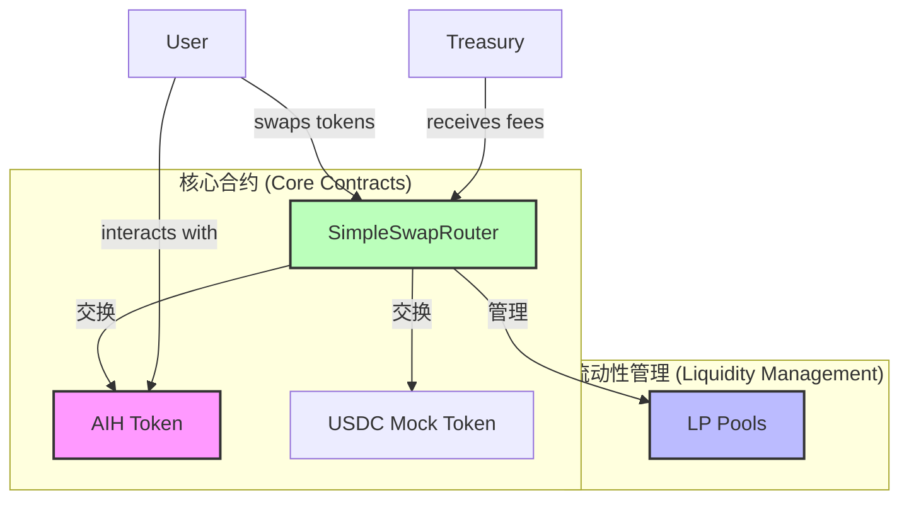
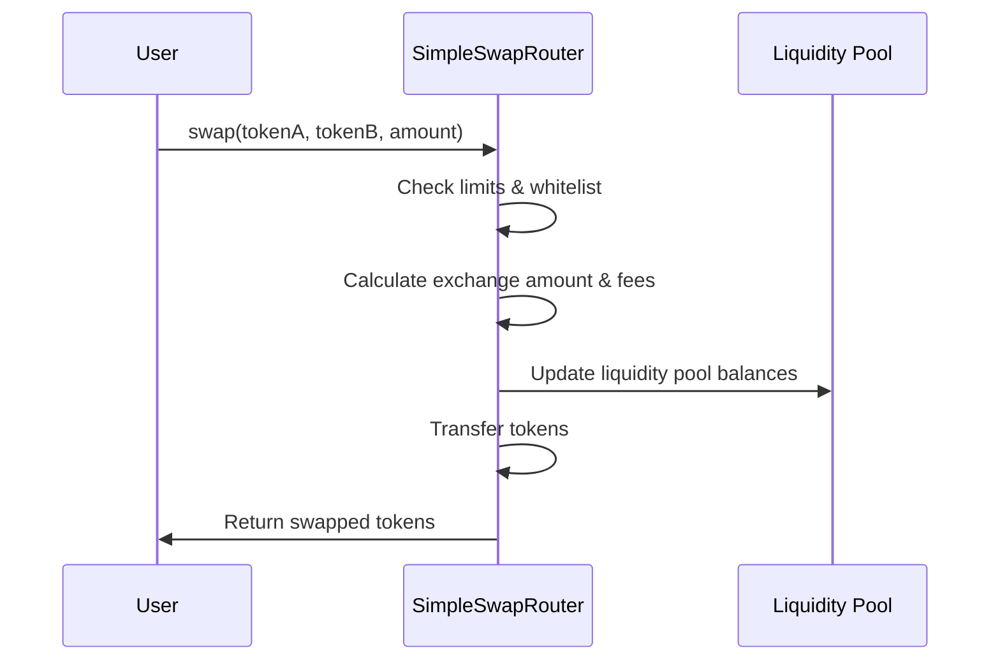
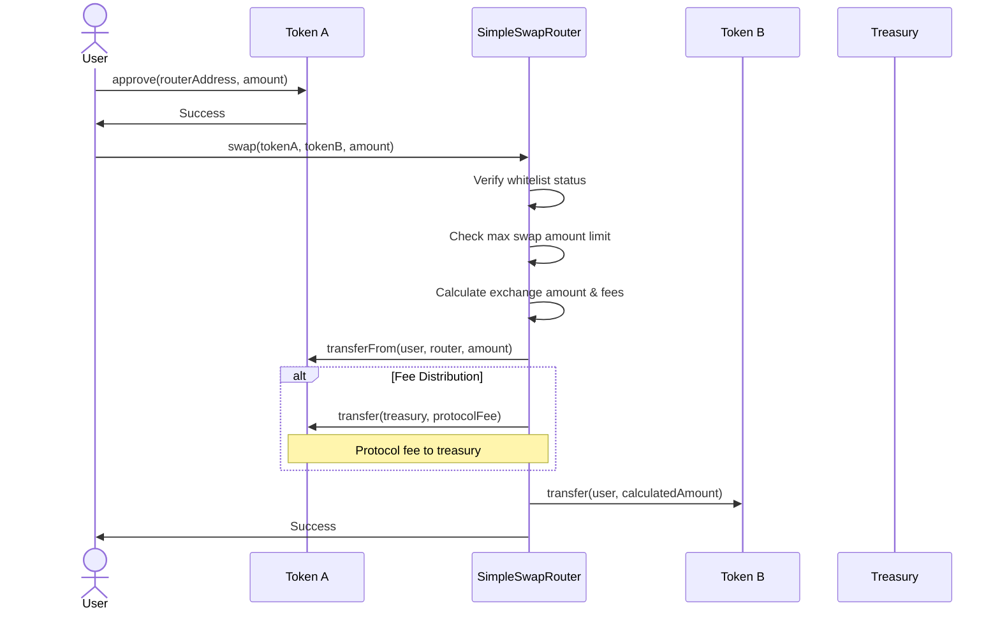
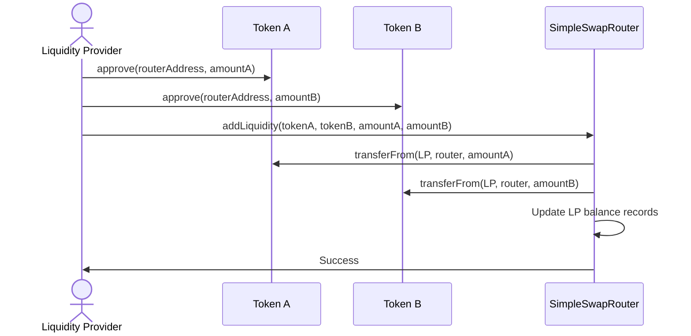

# AI Harvest Contract Architecture

AI Harvest是一个去中心化收益耕作平台，集成了多种DeFi功能，采用简化的智能合约架构。

This document provides a detailed overview of the AI Harvest contract architecture, including contract relationships, core components, and key features.

## 架构概览 (Architecture Overview)

AI Harvest platform has transitioned from upgradeable contracts to a simplified non-upgradeable design with SimpleSwapRouter at its core, reducing complexity while maintaining all essential functionality.



## 合约组件 (Contract Components)

### 1. 代币合约 (Token Contracts)

#### TestTokenUpgradeableV2
- ERC20兼容代币实现
- 支持铸造新代币
- 包含暂停功能
- 实现最大供应量限制
- 支持黑名单功能

### 2. 代币交换 (Token Swapping)

#### SimpleSwapRouter
- 提供代币兑换功能
- 收取交易费用并分配给流动性提供者和国库
- 管理流动性池
- 实现交易金额限制
- 支持代币白名单功能
- 包含紧急提取机制

## 简化架构 (Simplified Architecture)

项目已从可升级架构转向非可升级设计，以简化部署流程和避免初始化问题：

The project has transitioned from an upgradeable architecture to a non-upgradeable design to simplify deployment process and avoid initialization issues:

1. **非可升级合约 (Non-upgradeable Contract)** - 直接实现所有功能，无需代理
2. **简化状态管理 (Simplified State Management)** - 避免了代理合约的状态管理复杂性
3. **直接交互 (Direct Interaction)** - 用户和其他合约直接与SimpleSwapRouter交互



## 数据流 (Data Flow)

### 代币交换流程 (Token Swap Flow)



### 添加流动性流程 (Add Liquidity Flow)



## 安全考虑 (Security Considerations)

1. **重入保护 (Reentrancy Guards)**
   - 所有关键函数都实现了重入保护，防止重入攻击

2. **权限控制 (Access Control)**
   - 使用OpenZeppelin的Ownable模式限制敏感操作
   - 管理员功能只能由合约所有者调用

3. **白名单保护 (Whitelist Protection)**
   - 只允许白名单中的代币进行交换，提高安全性

4. **交易限制 (Transaction Limits)**
   - 实现最大交换金额限制，减少大额交易风险

5. **紧急提取 (Emergency Withdrawal)**
   - 提供紧急提取功能，允许在紧急情况下恢复资金

## 前端集成 (Frontend Integration)

前端通过contracts-simple.json文件和ABI目录与智能合约交互：

```json
{
  "networkName": "sepolia",
  "chainId": 11155111,
  "contracts": {
    "AIHToken": {
      "address": "0xFcB512f45172aa1e331D926321eaA1C52D7dce8E",
      "abi": "TestTokenUpgradeableV2.json"
    },
    "USDCToken": {
      "address": "0xB35B48631b69478f28E4365CC1794E378Ad0FA02",
      "abi": "TestTokenUpgradeableV2.json"
    },
    "SimpleSwapRouter": {
      "address": "0x5Dcde9e56b34e719a72CF060802D276dcb580730",
      "abi": "SimpleSwapRouter.json"
    }
  }
}
```

## 部署流程 (Deployment Process)

1. 部署AIH和USDC代币合约
2. 部署SimpleSwapRouter合约，设置国库地址和费率
3. 添加代币到白名单，设置最大交换限额
4. 添加初始流动性，设置初始汇率
5. 保存部署信息到JSON文件供前端使用

## 未来改进 (Future Improvements)

1. 实现治理机制，通过社区投票决定协议参数
2. 添加更多DeFi功能，如借贷和杠杆
3. 集成Layer 2解决方案，降低gas成本
4. 实现跨链功能，允许在多条区块链上操作
5. 添加高级交易策略，优化资金使用效率 