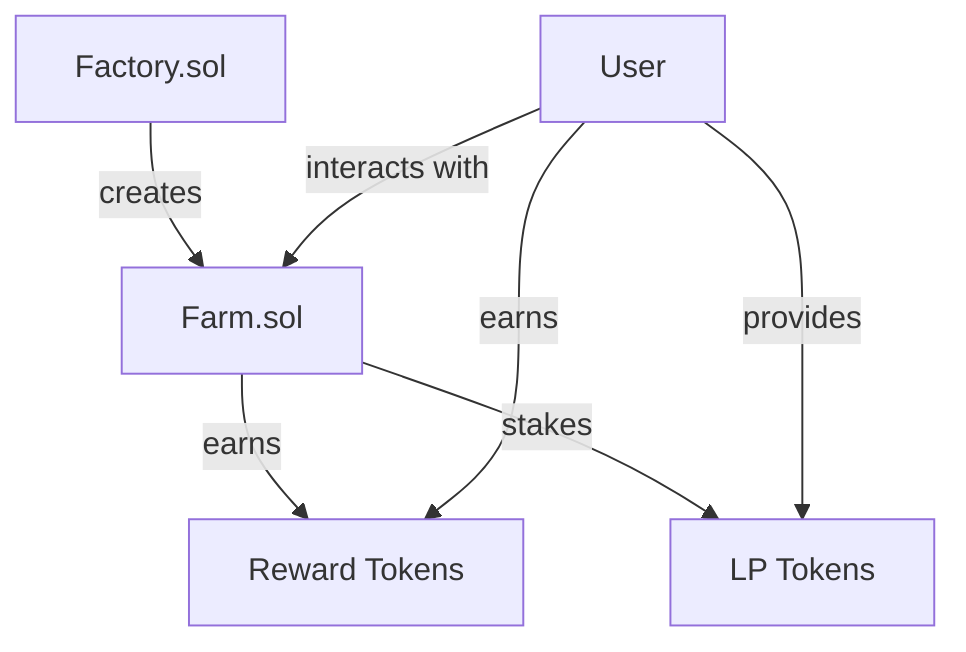

# AI Harvest Smart Contracts

This directory contains the smart contracts for the AI Harvest DeFi platform.

## Overview

AI Harvest is a yield farming platform with the following key features:

- Stake LP tokens to earn rewards
- Compound rewards automatically
- Timelock mechanism to discourage frequent trading
- Factory pattern for easier deployment
- Owner-controlled allocation points for different pools

## Contract Architecture



## Contracts

### Farm.sol

The main contract that handles staking, rewards, and withdrawals:

- **deposit**: Allows users to stake LP tokens
- **withdraw**: Allows users to withdraw LP tokens and claim rewards
- **compound**: Reinvests earned rewards automatically
- **pendingReward**: Calculates pending rewards for a user
- **emergencyWithdraw**: Allows emergency withdrawals without rewards in case of issues

### Factory.sol

A factory contract for deploying new Farm contracts:

- **createFarm**: Creates a new Farm contract with specified parameters
- **getAllFarms**: Returns all deployed Farm contracts
- **getMyFarms**: Returns all Farms created by a specific user

### TestToken.sol

A simple ERC20 token for testing purposes.

## Development

### Prerequisites

- Node.js
- npm or yarn
- Hardhat

### Installation

```bash
# Install dependencies
npm install

# Compile contracts
npx hardhat compile

# Run tests
npx hardhat test
```

### Testing

Tests are located in the `test` directory and can be run using Hardhat:

```bash
# Run all tests
npx hardhat test

# Run specific test
npx hardhat test test/Farm.test.js
```

### Deployment

To deploy the contracts to a network:

```bash
# Deploy to local hardhat network
npx hardhat run scripts/deploy.js

# Deploy to a specific network
npx hardhat run scripts/deploy.js --network goerli

# Deploy to mainnet
npx hardhat run scripts/deploy.js --network mainnet
```

## Security Considerations

The contracts implement several security features:

1. **ReentrancyGuard**: Protects against reentrancy attacks
2. **Pausable**: Allows emergency pausing of contract operations
3. **Timelock**: Prevents immediate withdrawals after deposits
4. **Input Validation**: Prevents common errors like zero amount transfers
5. **Custom Errors**: Provides clear error messages for better debugging

## Contributing

1. Fork the repository
2. Create your feature branch (`git checkout -b feature/amazing-feature`)
3. Commit your changes (`git commit -m 'Add some amazing feature'`)
4. Push to the branch (`git push origin feature/amazing-feature`)
5. Open a Pull Request

## License

MIT 