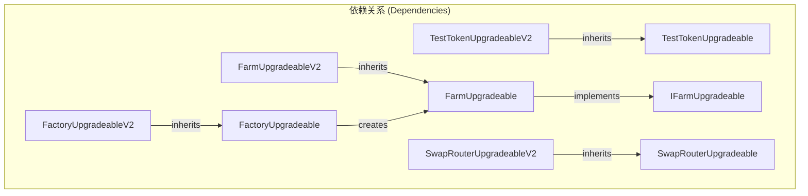
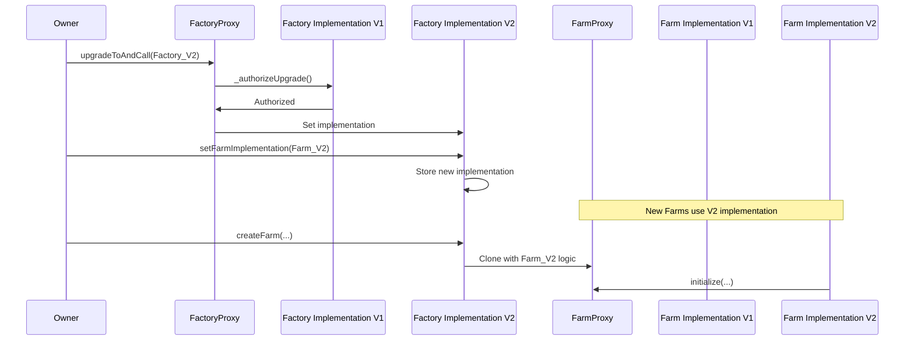
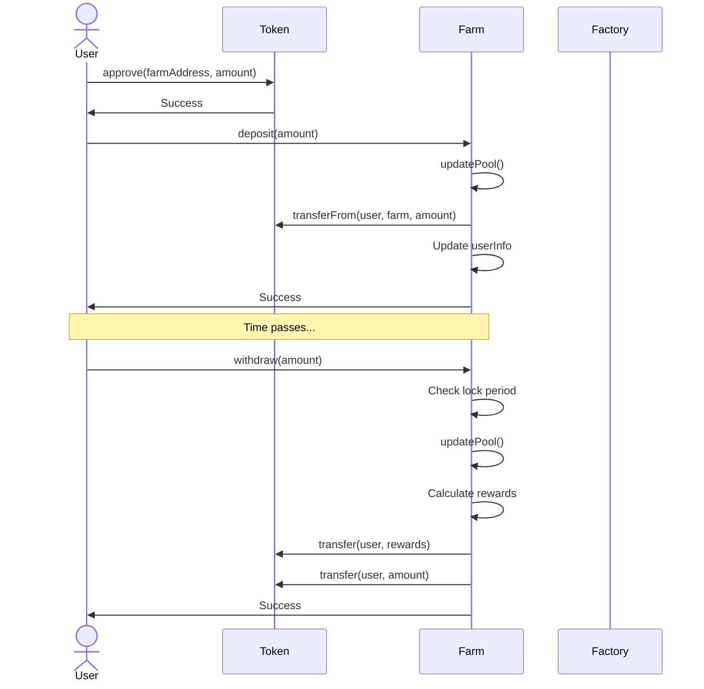
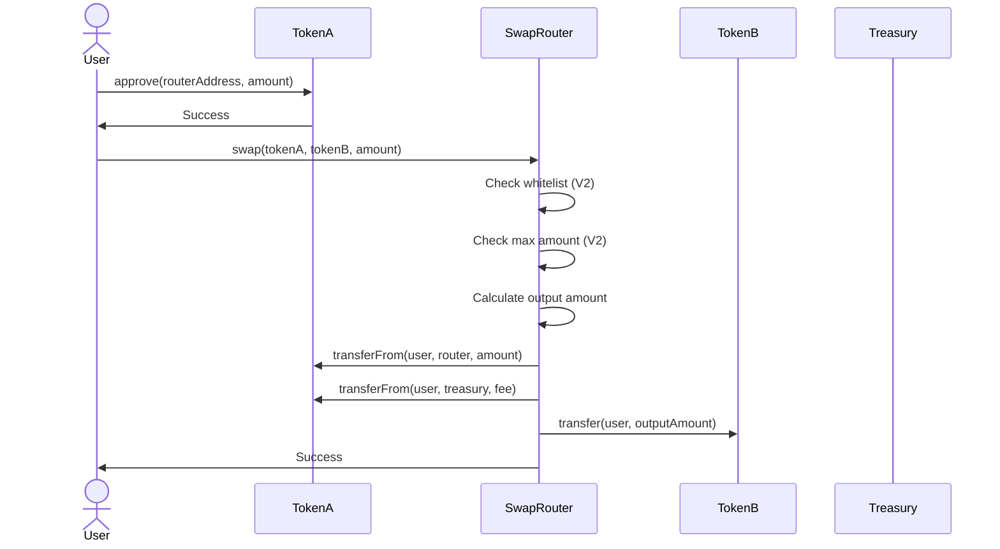
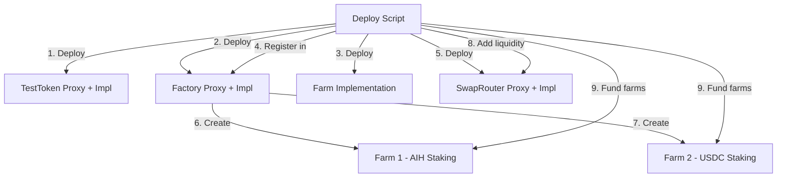
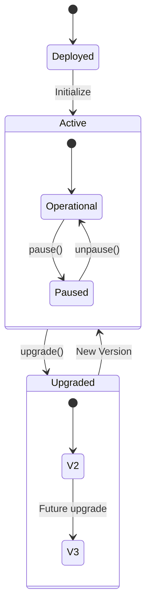
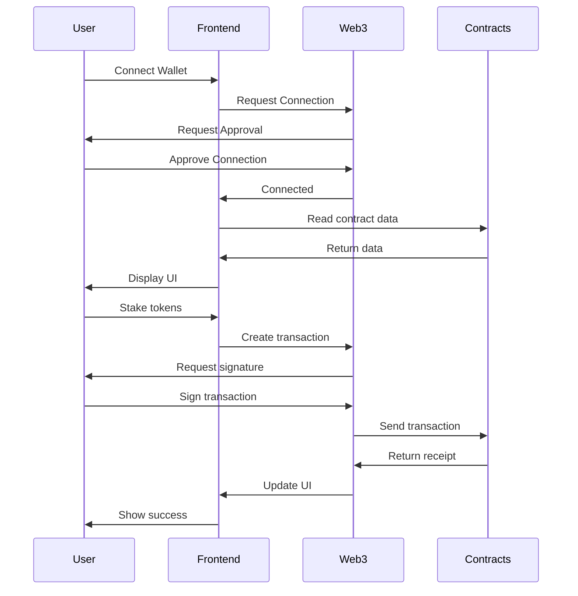
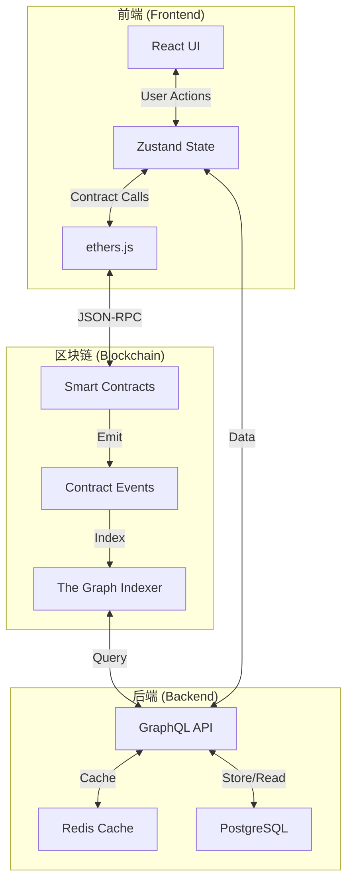

# AI Harvest Architecture Diagrams

AI Harvest是一个基于智能合约的DeFi收益平台，集成了多种功能和可升级架构。

This file contains various diagrams visualizing the architecture of the AI Harvest platform.

## 合约依赖关系图 (Contract Dependency Diagram)

## 升级流程图 (Upgrade Flow)

## 质押流程图 (Staking Flow)

## 代币交换流程图 (Token Swap Flow)

## 部署流程图 (Deployment Flow)

## 合约状态流程图 (Contract State Flow)

## 前端交互流程图 (Frontend Interaction Flow)

## 系统架构图 (System Architecture)

