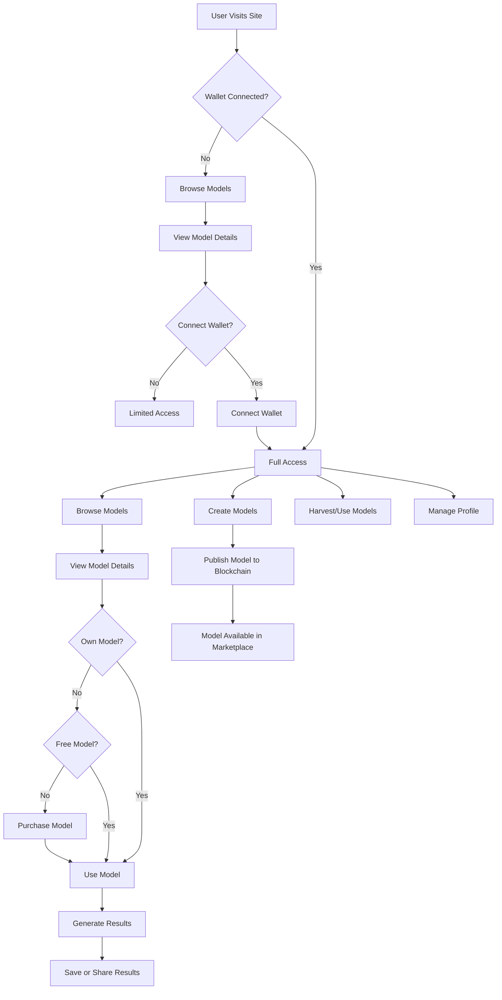

# AI Harvest Frontend Prototype Summary

## Overview
The AI Harvest frontend prototype is a modern React application that provides a user interface for interacting with the AI Harvest platform. It allows users to browse AI models, use them with prompts, purchase models, and manage their profile.

## Key Components

### Pages
1. **Home** - Landing page with feature highlights and introduction to the platform
2. **Models** - Displays a grid of available AI models with filtering capabilities
3. **ModelDetails** - Shows detailed information about a specific model
4. **Harvest** - Interface for selecting models and generating AI responses
5. **Create** - Form for creating and publishing new AI models
6. **Profile** - User profile showing created and purchased models
7. **NotFound** - 404 page for handling invalid routes

### Components
1. **Layout** - Main layout wrapper with navbar and footer
2. **Navbar** - Navigation bar with wallet connection features
3. **Button** - Reusable button component with different variants
4. **Card** - Flexible card component for displaying content
5. **ModelCard** - Specialized card for displaying AI model information

### State Management
1. **Web3Store** - Zustand store for managing Ethereum wallet connection

### Services
1. **API** - Service for making API requests to the backend

### Types
1. **AIModel** - Interface for AI model data
2. **HarvestRequest/Response** - Interfaces for AI prompt requests and responses
3. **UserProfile** - Interface for user profile data
4. **Web3State** - Interface for web3 connection state

## Technical Implementation

### Web3 Integration
The application integrates with Ethereum using ethers.js, allowing users to:
- Connect their wallet
- Purchase AI models
- Create and publish their own models

### Responsive Design
The UI is built with Tailwind CSS and follows responsive design principles to work well on:
- Desktop computers
- Tablets
- Mobile devices

### State Management
We've implemented a clean state management approach:
- Zustand for global state (Web3 connection)
- React state hooks for component-specific state
- Clear separation of concerns between data and UI

## Next Steps

1. **Backend Integration** - Connect to a real backend API instead of mock data
2. **Smart Contract Integration** - Implement actual blockchain transactions
3. **Authentication System** - Add user authentication and authorization
4. **Testing** - Add unit and integration tests
5. **Performance Optimization** - Implement code splitting and performance improvements
6. **Analytics** - Add usage analytics

## Application Flow

This frontend prototype provides a solid foundation for the AI Harvest platform, demonstrating the core functionality and user experience while allowing for future integration with blockchain and AI technologies. 