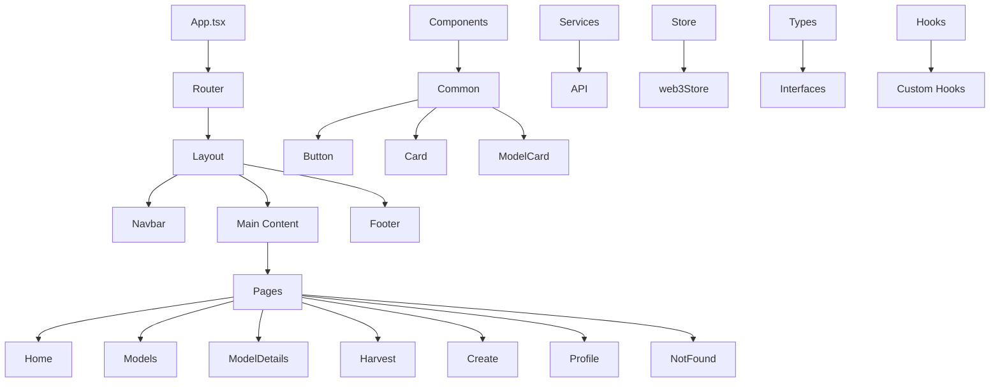

# AI Harvest Frontend Prototype

A modern React application for the AI Harvest platform, enabling users to discover, use, and create AI models with on-chain rewards.

## Features

- Browse AI models in the marketplace
- Purchase and use AI models
- Create and publish your own AI models
- User profile management
- Web3 wallet integration

## Technologies Used

- React with TypeScript
- React Router for navigation
- Tailwind CSS for styling
- Ethers.js for Ethereum interaction
- Zustand for state management
- Axios for API requests

## Application Structure



## Project Structure

```
src/
├── components/         # UI components
│   ├── common/         # Shared components
│   └── layout/         # Layout components
├── pages/              # Application pages
├── hooks/              # Custom React hooks
├── services/           # API and service functions
├── store/              # State management
├── types/              # TypeScript type definitions
├── utils/              # Utility functions
└── assets/             # Static assets
```

## Getting Started

1. Clone the repository
2. Install dependencies:
   ```
   npm install
   ```
3. Start the development server:
   ```
   npm start
   ```

## Environment Variables

Create a `.env` file in the root directory with the following variables:

```
REACT_APP_API_URL=http://localhost:3001/api
REACT_APP_FACTORY_ADDRESS=0x0000000000000000000000000000000000000000
REACT_APP_NETWORK_ID=5
REACT_APP_RPC_URL=https://eth-goerli.g.alchemy.com/v2/your_alchemy_key
```
