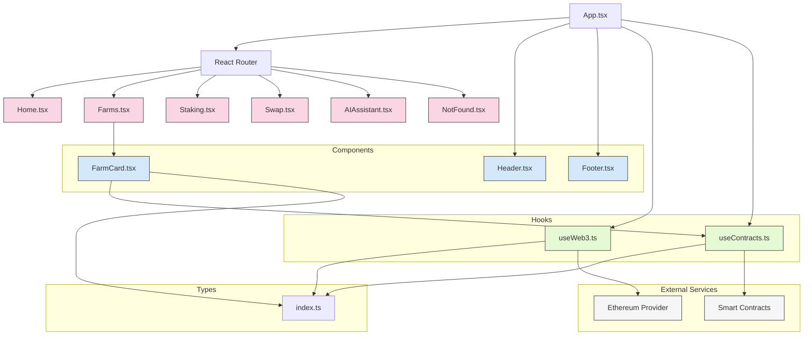
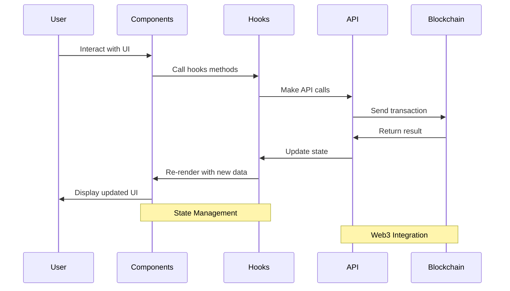
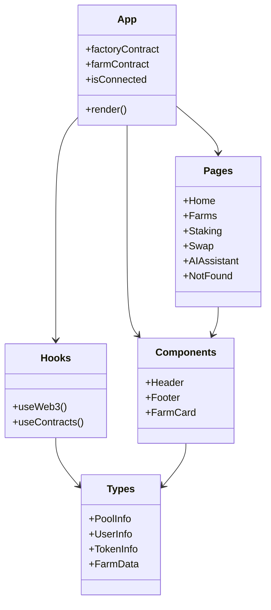

You can view this diagram by copying the code and pasting it into https://mermaid.live

# Frontend Data Flow

# Component Structure

These diagrams illustrate the structure and data flow of the AIHarvest frontend application. 