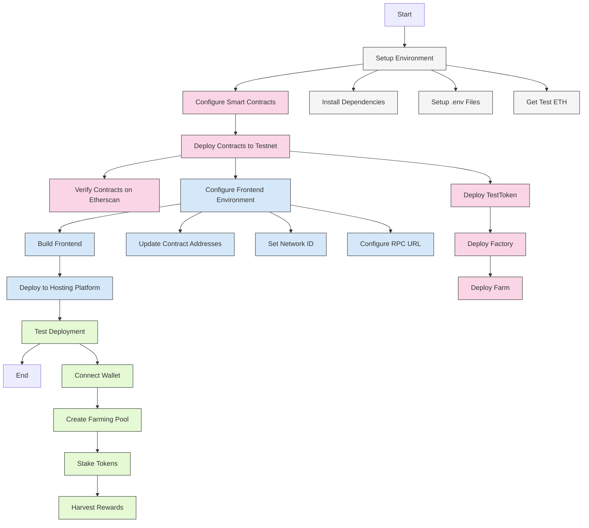

```mermaid
graph TD
    A[Start] --> B[Setup Environment]
    B --> C[Configure Smart Contracts]
    C --> D[Deploy Contracts to Testnet]
    D --> E[Verify Contracts on Etherscan]
    D --> F[Configure Frontend Environment]
    F --> G[Build Frontend]
    G --> H[Deploy to Hosting Platform]
    H --> I[Test Deployment]
    I --> J[End]

    %% Smart Contract Setup Details
    B --> B1[Install Dependencies]
    B --> B2[Setup .env Files]
    B --> B3[Get Test ETH]

    %% Contract Deployment Details
    D --> D1[Deploy TestToken]
    D1 --> D2[Deploy Factory]
    D2 --> D3[Deploy Farm]
    
    %% Frontend Details
    F --> F1[Update Contract Addresses]
    F --> F2[Set Network ID]
    F --> F3[Configure RPC URL]
    
    %% Testing Flow
    I --> I1[Connect Wallet]
    I1 --> I2[Create Farming Pool]
    I2 --> I3[Stake Tokens]
    I3 --> I4[Harvest Rewards]

    %% Styling
    classDef contract fill:#f9d5e5,stroke:#333,stroke-width:1px;
    classDef frontend fill:#d5e8f9,stroke:#333,stroke-width:1px;
    classDef testing fill:#e5f9d5,stroke:#333,stroke-width:1px;
    classDef setup fill:#f5f5f5,stroke:#333,stroke-width:1px;
    
    class B,B1,B2,B3 setup;
    class C,D,D1,D2,D3,E contract;
    class F,F1,F2,F3,G,H frontend;
    class I,I1,I2,I3,I4 testing;
```

You can view this diagram by copying the code and pasting it into https://mermaid.live 